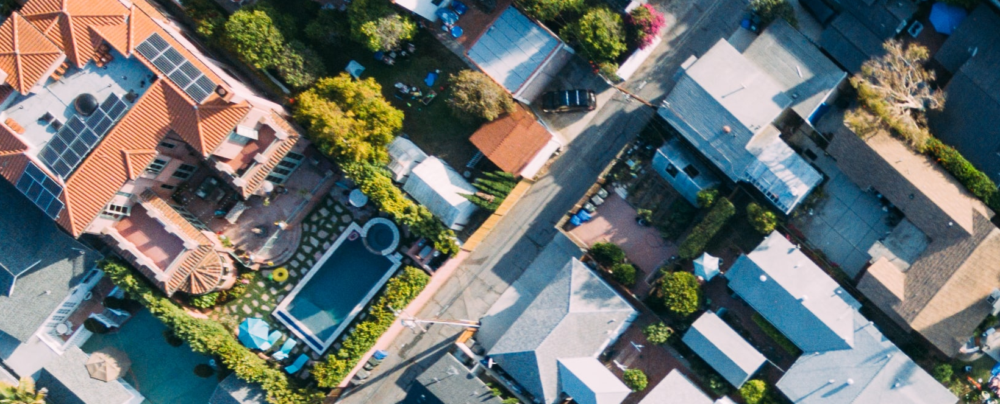

# California Housing Prices

In this project I'll use the dataset from the StatLib repository for learning purposes. This dataset is based on data from de 1990 California Census. It is not recent, but it has many qualities for learning, so I'll pretend it is recent data. I'm using this project as a practical exercise from the book *Hands-On Machine Learning with Scikit-learn, Keras & TensorFlow 2nd Edition*.

## End-to-End Machine Learning Project

In this project I'll follow the 8 steps presented in the second chapter of the book *Hands-On Machine Learning with Scikit-learn, Keras & TensorFlow 2nd Edition* :

1. Look at the big picture;
2. Get the Data;
3. Discover and visualize the data to gain insights;
4. Prepare the data for Machine Learning algorithms;
5. Select a model and train it;
6. Fine-tune my model;
7. Present my solution;
8. Launch, monitor, and maintain my system.